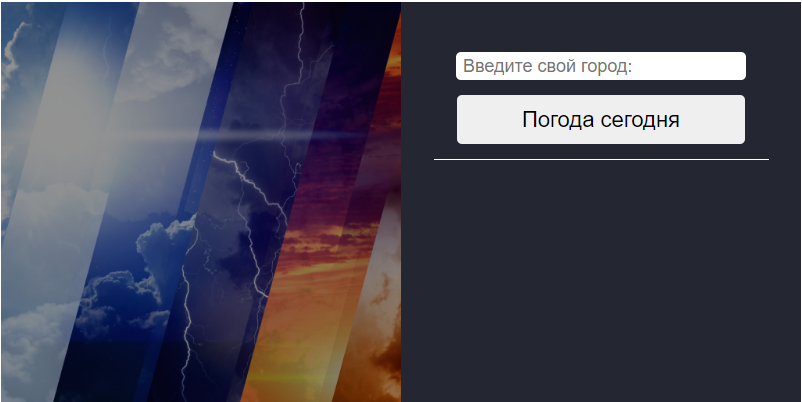

##Application on React JS "Learn Pogue in any city"
___
#####To run, run the following commands
```
git clone https://github.com/SilantievMax/weather-app.git
cd weather-app
npm install
npm start
```
In this application, you can find out the weather in any city.



<!-- 

 -->
Data that can be found:
- Temperature
- Pressure
- Humidity
- Wind speed
- Atmosphere pressure
- Sunrise and sunset
- Weather 

[Link API](https://openweathermap.org/)
